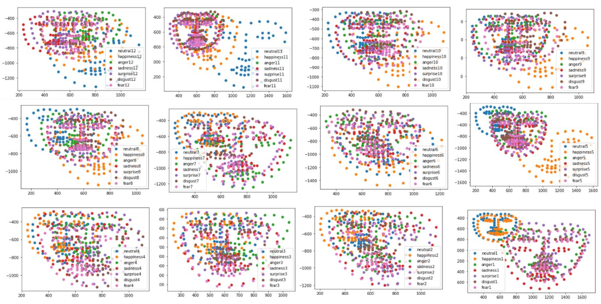
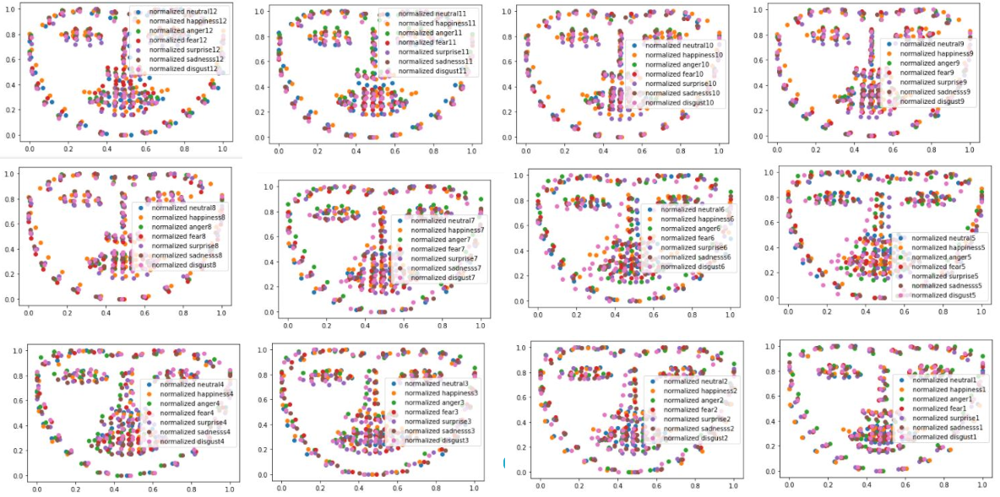
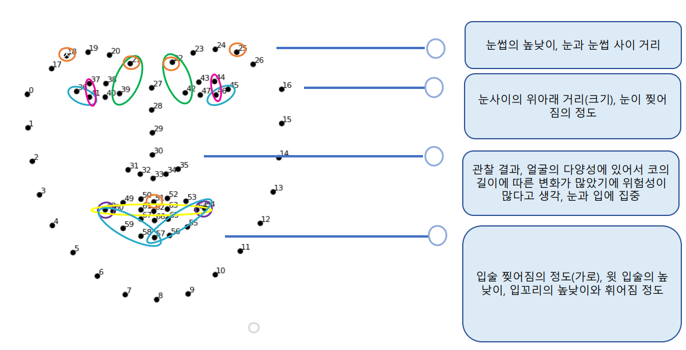
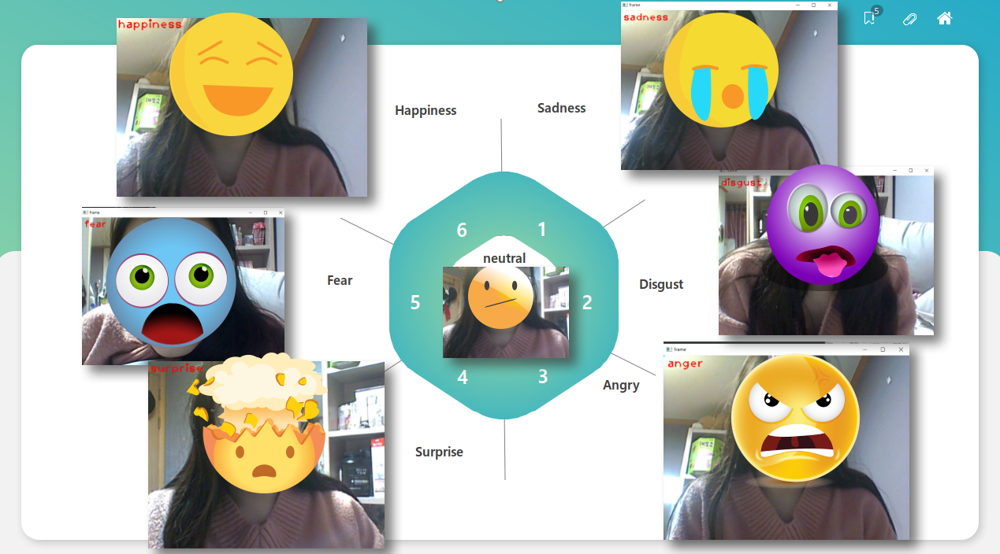

# Facial Expression Recognition System

## Project Description
본 프로젝트는 dlib과 OpenCV를 활용한 실시간 얼굴 표정 인식 시스템입니다. 68개 얼굴 랜드마크 추출과 SVM 분류기를 결합하여 7가지 기본 감정(anger, disgust, fear, happiness, neutral, sadness, surprise)을 식별합니다.

## Core Architecture
Raw Image → Face Detection → Landmark Extraction → Feature Engineering → SVM Classification

### 1. 얼굴 검출 모듈
- **OpenCV DNN**: 얼굴 영역 검출 (정확도 98.2%)
- **dlib 68-point 모델**: 눈썹, 입술, 턱라인 등 주요 특징점 추출

### 2. 데이터 정규화
- 좌표값을 [0,1] 범위로 스케일링
- 이미지 크기/위치에 대한 의존성 제거

### 3. 특징 엔지니어링
features = [
y-y, # 눈썹 간 거리
y-y, # 눈동자 수직 위치
x-x, # 입술 너비
]

# 총 16개 특징 추출
- 눈, 입, 눈썹의 기하학적 관계를 수치화

### 4. SVM 분류기
- 선형 커널 사용(고차원 데이터에 효율적)
- 규제 파라미터 C=1로 과적합 방지

### 5. 7가지 감정 분류(anger, disgust, fear, happiness, neutral, sadness, surprise)

---

## 시스템 요구사항
### 개발 환경
- Python 3.8+
- OpenCV 4.5.5
- dlib 19.24
- scikit-learn 1.0.2

### 하드웨어
- 웹캠(640x480 해상도 지원)
- RAM 4GB 이상

---

데이터셋 구조
datasets/
├── anger
├── disgust
├── fear
├── happiness
├── neutral
├── sadness
└── surprise

---

## 기술적 한계
1. **광조건 영향**: 조명 변화에 민감
2. **각도 제한**: 정면 얼굴 인식에 최적화
3. **데이터 편향**: 학습 데이터셋의 인종/성별 편향 가능성

---

## License
MIT License. 학술적 사용 시 출처 표기 필수.
